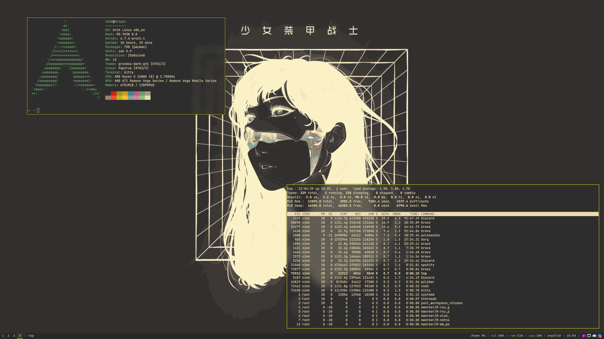

<div align="center"><i>Dotfiles</i></div>

---

- **Window Manager** - i3
- **Bar** - Polybar
- **Compositor** - Picom
- **Terminal** - Kitty
- **Shell** - ZSH (Oh-My-ZSH)
- **Screenshot util** - Flameshot

---



---

### Install Instructions (WIP)

```sh
$ git clone git@github.com:bonitoflakez/dots.git && cd dots

$ cp -r ./cfg/zshrc ~/.zshrc

$ cp -r ./cfg/i3 ~/.config/

$ cp -r ./cfg/nvim ~/.config/

$ cp -r ./cfg/kitty ~/.config/

$ cp -r ./cfg/picom ~/.config/

$ cp -r ./cfg/polybar ~/.config/
```
